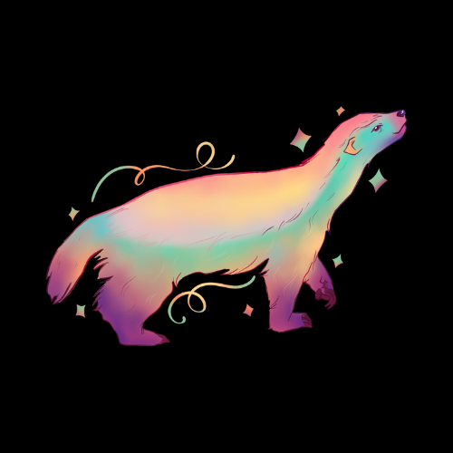
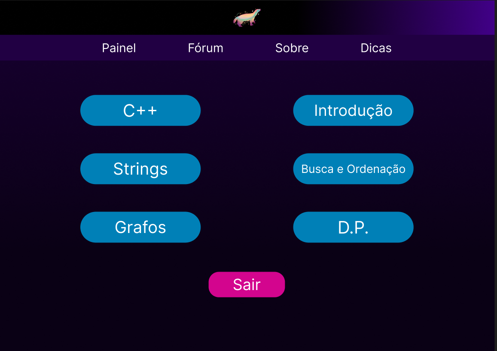

    

<h1 align="center">CodAmig@</h1>

 
 Esta é uma ideia para a construção de uma plataforma que busque 
 incentivar iniciantes em programação competitiva.

 

    

## 💡 Propósito

- **Guia**: orientar os estudantes nos primeiros passos das competições de programação.
- **Simplicidade**: apresentar explicação acessíveis e questões de nível de dificuldade adequado.
- **Motivação**: acompanhar o progresso dos estudantes, mantendo o foco na melhora de performance.
- **Engajamento**: incentivar a troca de conhecimentos entre estudantes iniciantes, intermediários e avançados.

A participação em competições de programação melhora o raciocínio para a resolução de problemas. 
 Dessa maneira, pretende-se, além de possibilitar um ambiente simplificado, instigar os estudantes a  resolverem questões de forma eficiente.

## 🦡 Projeto

- Acesse a estrutura do projeto <a href="https://www.figma.com/design/1CJhTW2cgIMz7KYV8dFdCc/Programa%C3%A7%C3%A3o-Competitiva?node-id=0-1&t=WvcueIgveePvPXYN-1">aqui</a>. São apresentadas as versões desktop e mobile.

## 🚀 Tecnologias

-  Figma
- 
  React
- 
  Tailwind CSS

## ⚖️ Licença

O projeto está sob licença MIT.
